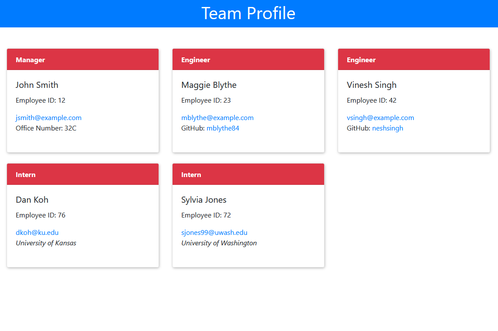

# Team Profile Generator

## Description
Generates a team profile webpage (`./dist/index.html`) from employee information entered at the command line.  Application prompts for the team manager's employee id number, name, email address, and office number.  After entering manager information, user selects whether to enter information for an engineer or an intern.  Both categories prompt for employee id, name, and email.  Engineers prompt for a github username, and interns prompt for current school.  When all team members have been entered, application generates an index.html file with cards for each team member that contain entered information.<br><br>
**Brief walk-through video**: [Team Profile Generator Screencast](https://watch.screencastify.com/v/QsikgMgu3BFbURsrzGdt)

## Installation
1. Clone this repository: `git clone git@github.com:kitrath/team-profile-generator`
2. Navigate to the base directory: `cd team-profile-generator`
3. Install dependencies: `npm install`

## Usage
Navigate to the `team-profile-generator/` directory and run `node index.js`.  You will be prompted for information about the team's manager first.  After entering information for each employee, you can choose to enter information for an engineer or an intern.  After all team members' information has been entered, select `Generate Team Profile` to generate a webpage (found at `./dist/index.html`) that includes cards for each team member.

## Tests

```shell
npm test
```

## Screenshot
<p align="center"></p>